# ⚡ AllSpark

[](https://www.docker.com/)
[](https://www.mongodb.com/)
[](https://redis.io/)
[](https://kafka.apache.org/)
[](https://react.dev/)
[](https://nodejs.org/)

> **AllSpark is a distributed, microservices-based coding and evaluation platform built for problem solving, competitive programming, automated code execution, administration, and support workflows.**

AllSpark separates major platform responsibilities into independent backend services and uses **Apache Kafka for event-driven communication, Redis for caching and real-time state, MongoDB for persistent data, WebSockets for live updates, and Docker for local infrastructure orchestration.**

---

## 📸 Product Preview

### Feature Tour

<p align="center">
  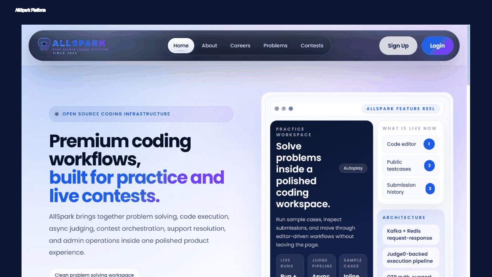
</p>

### Home

<p align="center">
  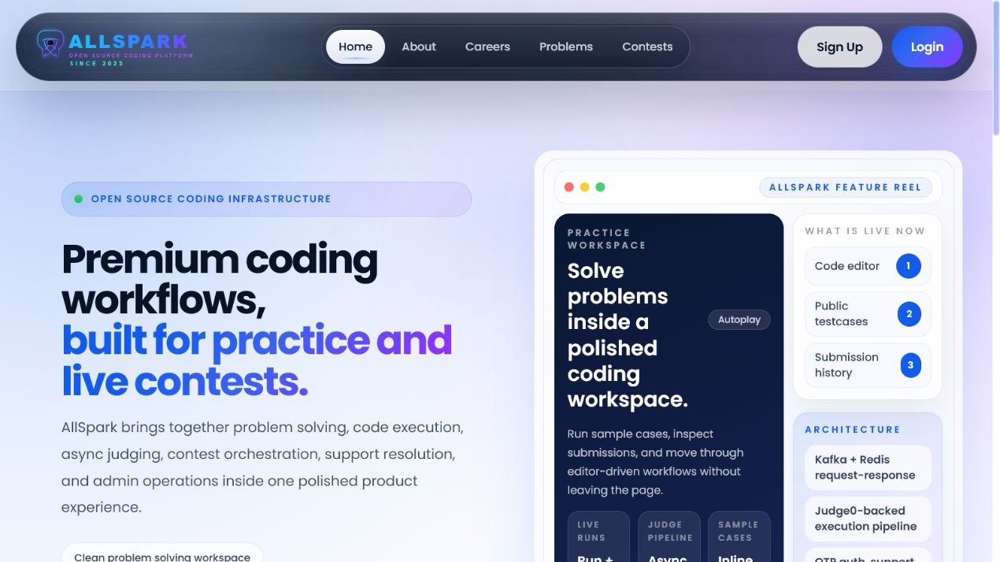
</p>

### Problem Library

<p align="center">
  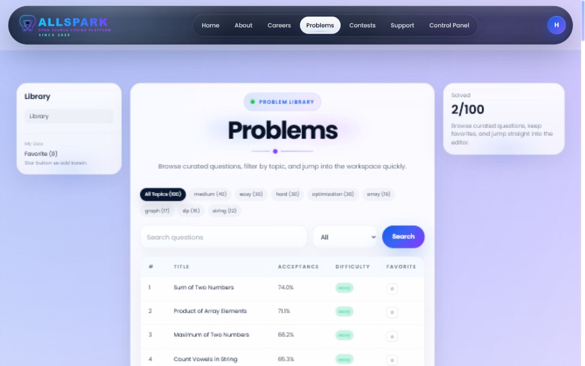
</p>

### Contest Arena

<p align="center">
  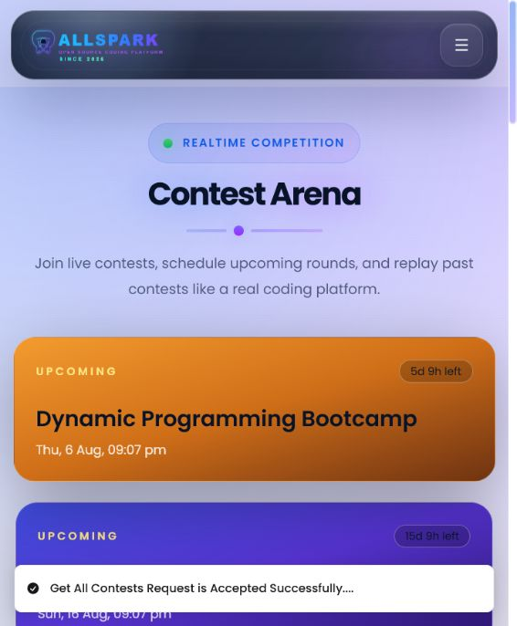
</p>

<details>
<summary>More Screens</summary>

### About

<p align="center">
  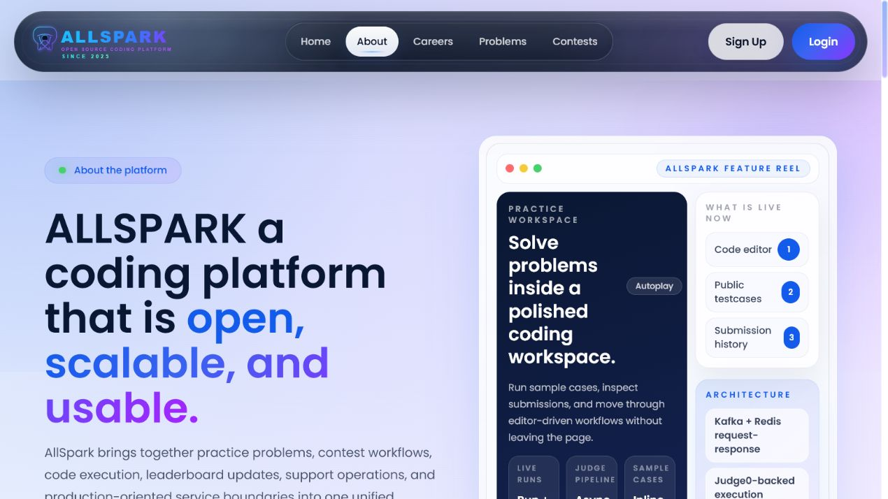
</p>

### Careers

<p align="center">
  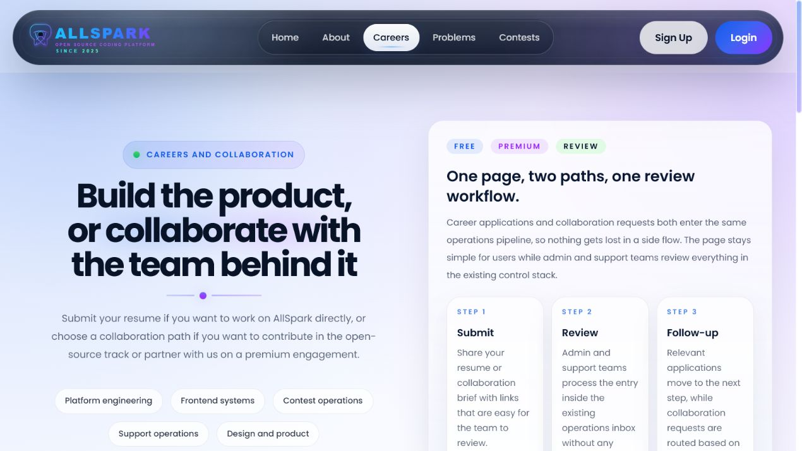
</p>

### Sign Up

<p align="center">
  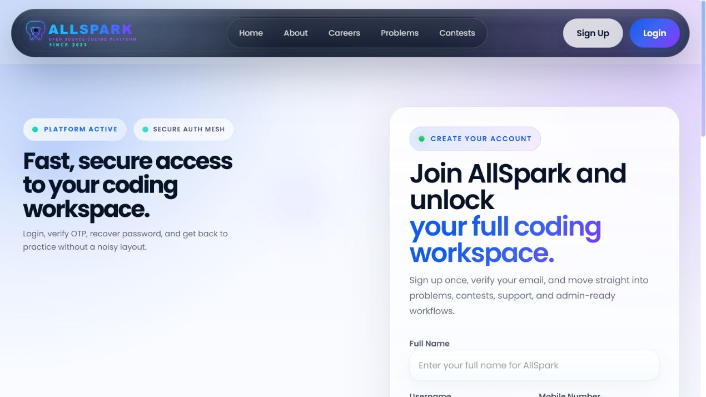
</p>

### Login

<p align="center">
  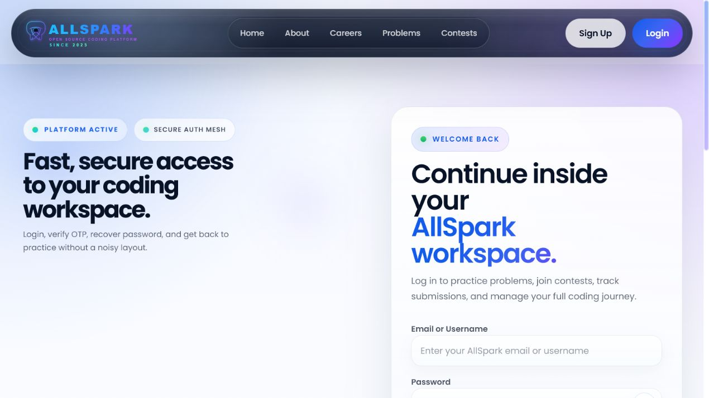
</p>

### Coding Workspace

<p align="center">
  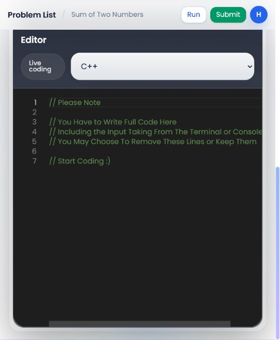
</p>

### Contest Details

<p align="center">
  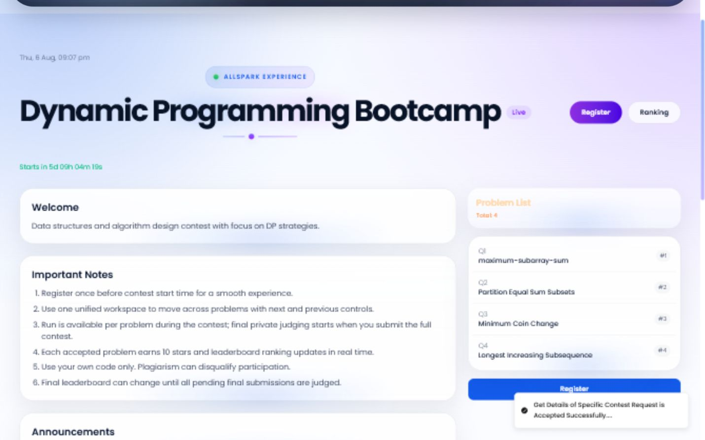
</p>

### Support Center

<p align="center">
  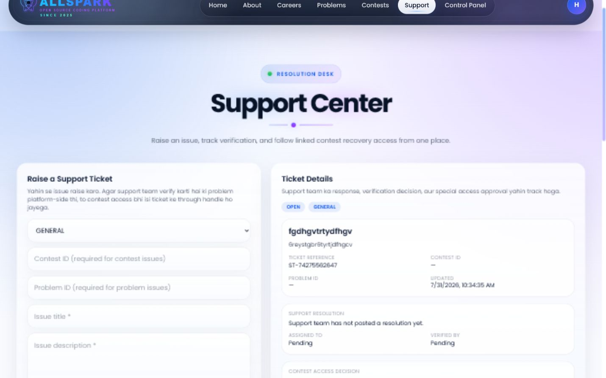
</p>

### Support Ticket Tracking

<p align="center">
  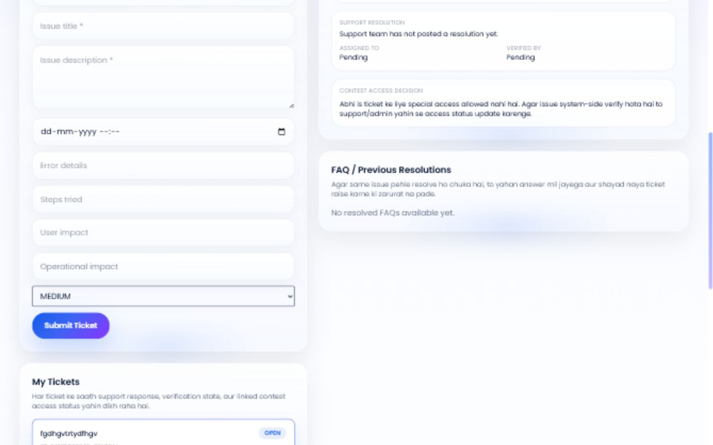
</p>

### Admin Control Panel

<p align="center">
  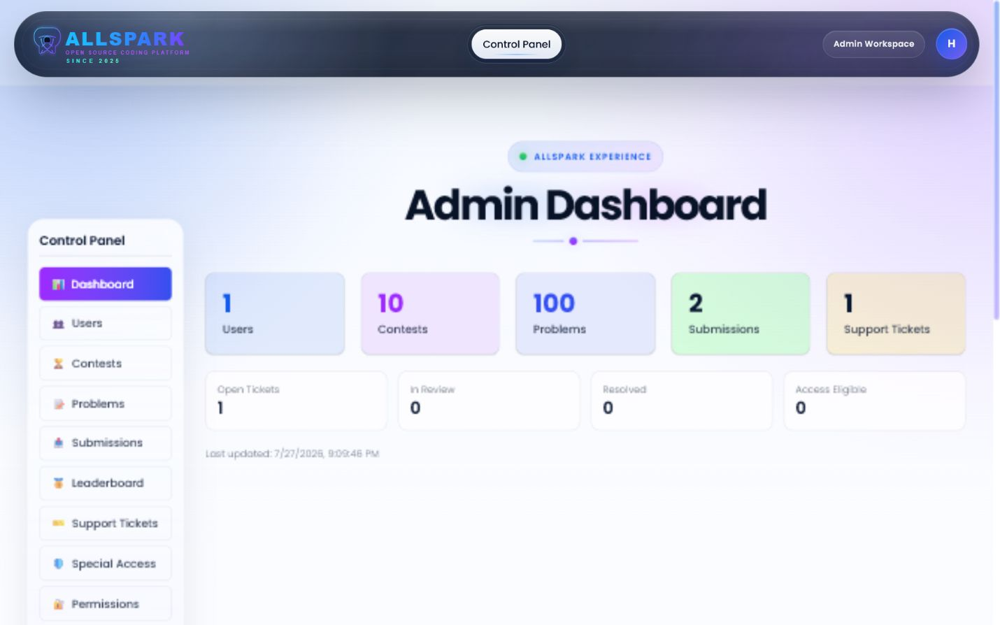
</p>

</details>

---

## 🎯 Overview

AllSpark is a distributed coding platform designed to handle the major workflows involved in an online coding and evaluation system.

The platform includes:

- User authentication and account management
- Email OTP verification
- Coding problems and submissions
- Automated code execution
- Competitive programming contests
- Live leaderboards
- Role-based permissions
- Administrative workflows
- Support ticket management
- Real-time application updates

Instead of implementing the entire backend as one application, AllSpark separates major responsibilities into independent services and uses asynchronous events where appropriate.

---

## ✨ Core Features

### 👤 Authentication & User Management

- User signup and login
- OTP-based email verification
- Forgot password
- Password reset
- Account activation/deactivation
- User management
- JWT-based authentication

### 💻 Coding & Evaluation

- Problem library
- Online coding workspace
- Code execution
- Submission processing
- Submission results
- Judge0-compatible execution integration

### 🏆 Contests

- Contest listing
- Contest participation
- Contest submissions
- Contest problem solving
- Live leaderboard updates

### ⚡ Real-Time System

- WebSocket-based updates
- Live leaderboard updates
- Real-time submission-related updates
- Event-driven backend communication

### 🔐 Authorization & Admin

- Role-based access control
- Permission management
- Admin control panel
- Protected administrative workflows

### 🎫 Support

- Support ticket creation
- Ticket tracking
- Support workflows
- Special access / approval flows

### 📨 Email & OTP

- OTP-based account verification
- Password recovery emails
- MailHog integration for local development

---

# 🏗️ Architecture

AllSpark follows a **microservices + event-driven architecture**.

```mermaid
flowchart TB

    Client[React + Vite Frontend]

    Gateway[API Gateway]

    Auth[Authentication Service]
    Users[User Management]
    Permissions[Permission Service]
    Problems[Problems & Contests]
    Submissions[Submission Service]
    Support[Support Service]

    Mongo[(MongoDB)]
    Redis[(Redis)]
    Kafka[(Apache Kafka)]
    Judge[Judge0-Compatible Engine]
    Mail[MailHog / SMTP]

    Client --> Gateway

    Gateway --> Auth
    Gateway --> Users
    Gateway --> Permissions
    Gateway --> Problems
    Gateway --> Submissions
    Gateway --> Support

    Auth --> Mongo
    Users --> Mongo
    Problems --> Mongo
    Submissions --> Mongo
    Support --> Mongo

    Auth --> Mail

    Submissions --> Judge

    Auth <--> Kafka
    Users <--> Kafka
    Problems <--> Kafka
    Submissions <--> Kafka
    Support <--> Kafka

    Submissions --> Redis
    Problems --> Redis
    Kafka --> Redis

    Redis --> Client
